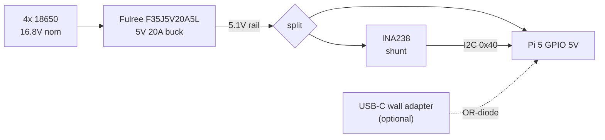
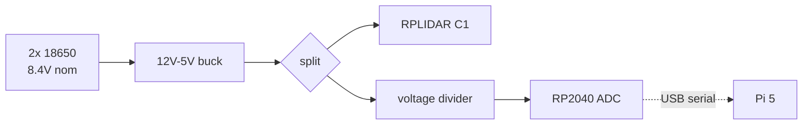
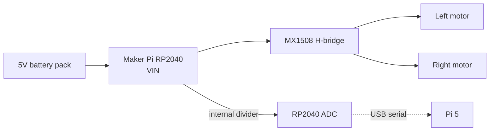

# Navbot Power Architecture

> ⚠️ **OUTDATED as of 2026-06-16 (home reassembly, session 13).** The power
> architecture was reworked: a **3S LiPo + 5V converter now feeds the Pi 5
> only** (clean, `throttled=0x0`), and the **INA238 was moved to the motor
> power rail** (which also powers the RP2040, reads ~6.27 V); the LiDAR is
> separately powered. The three-battery description and diagrams below
> reflect the **prior office configuration** and need a full revision once
> the new topology is confirmed and measured. Current authoritative state:
> [project-status.md](project-status.md) and
> [validation/records/2026-06-16-home-reassembly-bringup.md](validation/records/2026-06-16-home-reassembly-bringup.md).
> Also pending: INA238 recalibration for the motor rail (see
> [hardware/ina238.md](hardware/ina238.md)).

## Overview

The robot runs on three independent battery systems. Each has its own
switch, its own step-down converter, and its own monitoring path.

The three systems are electrically isolated from each other — **but the
Pi 5 is not automatically isolated from System 1 by its USB-C input
alone**. See the System 1 section for the detailed mechanism and the
in-situ measurement that confirmed the non-isolation.

| System | Battery | Rail | Consumers | Monitoring |
|---|---|---|---|---|
| 1 | 4× 18650 (16.8V nom) | 5.1V via Fulree F35J5V20A5L buck | Pi 5 + I²C sensors | INA238 at I²C 0x40 |
| 2 | 2× 18650 (8.4V nom)  | 5V via 12V-5V buck | RPLIDAR C1 + RP2040 ADC | RP2040 ADC → `/base/lidar_voltage` |
| 3 | 5V dedicated pack    | 5V to Maker Pi VIN | RP2040 VIN → MX1508 → motors | RP2040 VIN divider → `/base/motor_voltage` |

## System 1: Pi Compute

- **Battery:** 4× 18650 cells in series. 16.8V fully charged, 14.4V
  pack minimum before brownout risk. Dedicated switch in pack.
- **Converter:** Fulree F35J5V20A5L — 5V 20A DC-DC buck.
- **Output rail:** 5.1V to Pi 5 GPIO header and INA238 breakout.
- **Monitoring:** INA238 via I²C → `/power/ina238/*` topics. Driver:
  [ros2_ws/src/navbot_power/navbot_power/ina238_reader.py](../ros2_ws/src/navbot_power/navbot_power/ina238_reader.py) (commit b309625).
- **Topics published at 2 Hz:**
  `/power/ina238/bus_voltage_v`, `/power/ina238/current_a`,
  `/power/ina238/power_w`, `/power/ina238/temperature_c`,
  `/power/ina238/shunt_voltage_v`, `/power/ina238/status`.

### IMPORTANT: USB-C Does NOT Isolate Pi From This System

The Pi 5's USB-C input and GPIO 5V pin OR-together through internal
protection diodes. When both are present, current flows from whichever
source is at the higher voltage into the rail, and from there back down
the lower-voltage source's path with only diode drop penalty.

**In-situ measurement (2026-04-20):** while the Pi was on USB-C wall
adapter AND System 1 battery pack was switched ON, INA238 measured
0.94 A flowing through the shunt — proving the rail was not electrically
isolated from the battery.

**Implications for test design:**

- "Pi on wall power" does not mean "Pi isolated from System 1 battery."
- Motion tests assuming electrical isolation must verify it explicitly
  rather than trust the USB-C adapter.
- The pre-flight safety checklist ([RUNBOOK.md](RUNBOOK.md)) requires
  reading `/power/ina238/current_a` before any isolation-dependent test.

**To actually isolate the Pi from System 1:**

- Physically disconnect the GPIO 5V jumper between the buck output and
  the Pi header, OR
- Switch the System 1 battery pack OFF.

Either gives a true electrical break. Re-verify isolation by reading
`/power/ina238/current_a` — should be near 0 A, and `bus_voltage_v`
should read only what the USB-C adapter provides.

## System 2: LiDAR

- **Battery:** 2× 18650 cells in series, 8.4V nominal.
- **Converter:** 12V-5V buck (generic module).
- **Output:** 5V to LiDAR and to a voltage divider into the RP2040 ADC.
- **Monitoring:** RP2040 publishes `/base/lidar_voltage` via the serial
  bridge.
- **Known symptom of low pack voltage:** CP210x `-110 on control
  transfer 0x12` errors from the LiDAR serial link. This is almost
  always System 2 undervoltage, not a USB bus issue.

## System 3: Motors

- **Battery:** 5V dedicated pack (separate from Pi and LiDAR systems).
- **Motor driver:** MX1508 H-bridge on the Maker Pi RP2040 board.
- **Monitoring:** RP2040 publishes `/base/motor_voltage` via serial bridge.
- **Known issue — "C7 bug":** the `/base/motor_voltage` topic currently
  reports a rail-scaled value (reads ~5.13V on a charged pack) rather
  than the true battery voltage. This is a firmware bug slated for a
  future iteration; it is a known-bad value, not a true rail fault.
  Tracked in [project-status.md](project-status.md) backlog.

## Future: Motor Rail Current Monitoring

Current plan is to rely on the MX1508 built-in current-sense outputs
(if the RP2040 firmware exposes them). For higher-fidelity monitoring —
e.g. safely tuning active counter-drive braking — a second INA238 on
the motor rail is in the Phase C backlog.

Placement options under consideration:

1. High-side, between battery and Maker Pi VIN pin
2. Low-side, between MX1508 GND and battery GND

Option 1 measures the total motor-stack current (including MX1508
quiescent) and is less invasive to the existing wiring. Option 2
measures only motor-driver output current. The counter-drive tuning
work will determine which resolution is needed.

## Datasheet References

- **INA238:** TI SBOSA20C (newer than SBOSA20A; SBOSA20A lacks the
  DEVICE_ID register definition at 0x3F, which caused confusion during
  Phase C driver debugging).
- **INA237 / INA238 equivalence:** register-identical; driver works for
  both. Differ only in gain-error and offset specs.
- **Fulree F35J5V20A5L:** vendor datasheet (Chinese) — primary
  reference is the product page listing.
- **RPLIDAR C1:** Slamtec C1 datasheet and developer's guide.
- **MX1508:** datasheet archived under
  `firmware/makerpi_rp2040_base/docs/` (if vendored).
