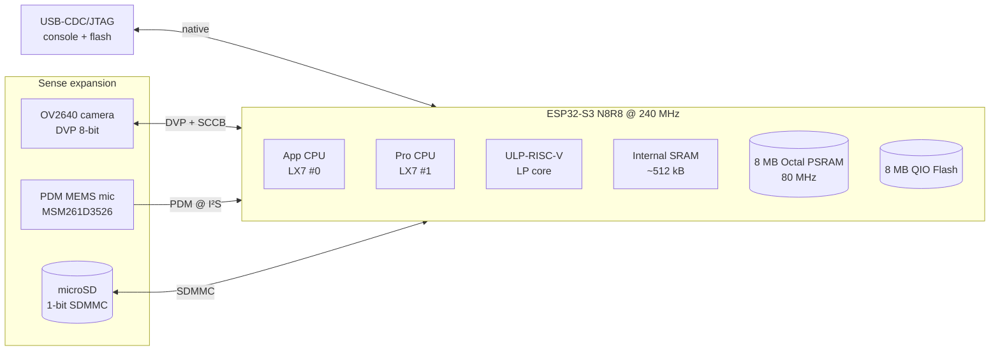

# Architecture — xiao-esp32-s3-sense

## Block view (target end-state, multi-phase)



## Phase layering

```
Phase 1  bring-up        : chip_info + heartbeat LED
Phase 2  camera          : OV2640 init, JPEG single-frame to log
Phase 3  microphone      : PDM via I2S RX, RMS print
Phase 4  microSD         : SDMMC mount, append CSV
Phase 5+ application     : per-project (TBD)
```

Each phase ends with a smoke test that gates the next. See `CLAUDE.md` §5.

## Memory plan

| Region | Size | Use |
|---|---|---|
| Internal SRAM | ~512 kB | task stacks, ISR-touched buffers, DMA descriptors |
| PSRAM | 8 MB | camera frame buffers, audio circular buffer, `malloc()` overflow |
| Flash | 8 MB | bootloader, partition table, app, NVS, OTA0/OTA1 (future), spiffs/littlefs (future) |

DMA-capable buffers (esp_camera, I²S RX, SDMMC) **must** be allocated with `MALLOC_CAP_DMA` from internal SRAM. PSRAM is not DMA-coherent for these peripherals on ESP32-S3 silicon rev v0.x.

## Concurrency model

- **App CPU (core 0):** networking, file I/O, app logic.
- **Pro CPU (core 1):** real-time pinning for camera + audio capture tasks.
- **No code in ISR** beyond signalling (`xTaskNotifyFromISR`, ring-buffer push).
- **Watchdog:** Task WDT enabled on both cores at IDF default 5 s; idle task hooks feed it.

## Logging

- ESP-IDF `esp_log` over USB-Serial/JTAG @ default 115200.
- All app logs use `TAG = "sense_<module>"` so filtering (`idf.py monitor --print_filter "sense_*:I"`) works.
- Reset reason logged on every boot.
